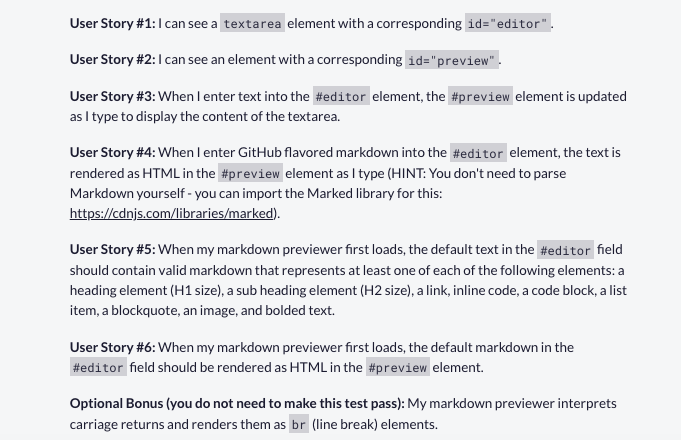
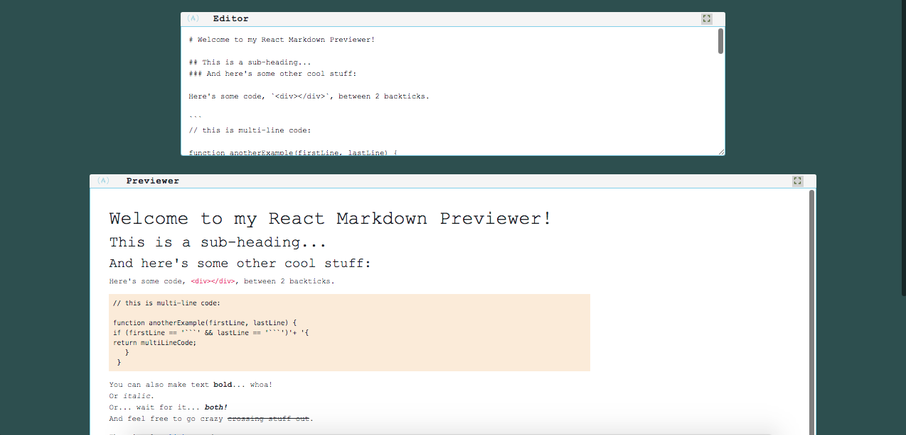

# Markdown_Previewer

#### This file covers the following topics 
- App description
- Implementation note
- Note on icons usage
- App Requirements
- App Mock Up

&nbsp;
&nbsp;
### App Description
> This app interprets any valid Markdown text entered by user in the 'Editor' textarea into corresponding html elements and renders the html in the 'Previewer' pane .

&nbsp;
&nbsp;
### Implementation Note
App has been implemented using html, CSS Javascript and jQuery.

&nbsp;
&nbsp;
### Note about icons used in the HTML file
> I've used Fontawesome icons for the up/down arrows in the buttons. These icons are placed within 'i' tags in the HTML file. In order to use Fontawesome icons, one has to download a kit from Fontawesome.com. A kit is basically a script tag supplied by Fontawesome.com which one needs to include in the head section of the HTML. Since my kit is my own, I have **NOT** included it in head section of the HTML file that I have uploaded to this repo. So, if you'd like to use up/down arrow icons that I **do** include in the HTML, please make sure that you **get your own Fontawesome kit and include it in the head section of the HTML.** Alternatively, *you may use icons from any other source online and in that case please make sure you update the HTML file as needed to use your own icons.*

&nbsp;
&nbsp;
### App Requirements

&nbsp;
&nbsp;
### App Mock Up

